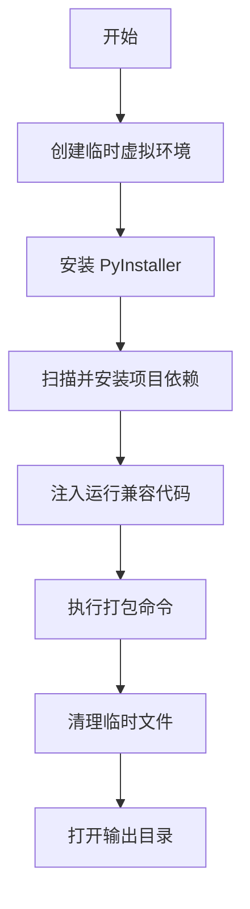

<div align="center">

# 🐍 Python 全自动 EXE 打包工具

[](https://www.python.org/)
[](LICENSE)
[](https://www.microsoft.com/windows)
[](https://github.com/yourusername/yourrepo)

**一款界面精美、功能强大的 Python 源码一键 EXE 打包工具**


</div>

---

## 📚 目录

- [✨ 功能特点](#-功能特点)
- [🚀 快速开始](#-快速开始)
- [📦 版本说明](#-版本说明)
- [📖 使用说明](#-使用说明)
- [🎯 常见问题](#-常见问题)
- [📁 项目结构](#-项目结构)
- [🛠️ 技术栈](#-技术栈)
- [🤝 贡献指南](#-贡献指南)
- [📄 许可证](#-许可证)

---

## ✨ 功能特点

<div align="center">

| 特性 | 描述 |
|------|------|
| 🎯 **纯净虚拟环境打包** | 在临时虚拟环境中打包，避免依赖冗余，生成体积更小的 EXE |
| 📦 **自动依赖检测** | 智能扫描 Python 源码中的第三方依赖，自动安装 |
| 🖥️ **单文件模式** | 支持打包为单个独立 EXE 文件，便于分发 |
| 🎨 **自定义图标** | 支持添加 ICO 图标，让您的程序更专业 |
| 🧹 **自动清理** | 打包完成后自动清理临时文件和缓存 |
| 📋 **进度可视化** | 实时显示打包进度，让您随时了解打包状态 |
| 🖱️ **拖拽支持** | 支持拖拽文件到界面，操作更加便捷 |
| 🔧 **中文友好** | 自动修复中文乱码问题，支持中文路径 |

</div>

---

## 🚀 快速开始

### 直接运行源码

```bash
# 运行程序
python Python全自动EXE打包工具.py
```

---

## 📦 版本说明

<div align="center">

| 版本 | 依赖要求 | 特点 |
|------|------------|------|
| 🐍 **Python全自动EXE打包工具.py** | 需要 Python 3.8+ 环境 | ✅ 打包出的 EXE 体积更小 |
| ⚡ **Python全自动EXE打包工具PLUS.py** | 无需 Python 环境 | 📦 打包出的 EXE 体积较大 |

</div>

---

## 📖 使用说明

### 1️⃣ 选择打包模式

- ✅ **使用纯净虚拟环境打包（推荐）**：在临时虚拟环境中进行打包，避免系统 Python 环境影响
- 🗑️ **打包完成自动删除虚拟环境文件夹**：保持工作目录整洁

### 2️⃣ 配置文件

| 选项 | 说明 |
|------|------|
| 📄 目标 Python 源码 | 选择要打包的 `.py` 文件（支持拖拽） |
| 🎨 程序图标 | 选择 `.ico` 格式的图标文件（可选） |

### 3️⃣ 打包参数设置

<div align="center">

| 参数 | 说明 | 推荐设置 |
|------|------|----------|
| 打包为单个 EXE 文件 | 生成独立可执行文件 | ✅ 是 |
| 隐藏命令行黑窗口 | GUI 程序推荐勾选 | ✅ 是 |
| 自动修复中文乱码 | 解决中文显示问题 | ✅ 是 |
| 打包后清理缓存文件 | 删除 build 和 __pycache__ 等临时文件 | ✅ 是 |
| 打包后卸载新增依赖库 | 从虚拟环境卸载本次安装的依赖 | ✅ 是 |

</div>

### 4️⃣ 开始打包

点击 **开始全自动打包** 按钮，工具会自动完成以下步骤：



---

## 🎯 常见问题

### Q: 打包速度慢怎么办？
A: 首次运行会创建虚拟环境和安装依赖，后续打包会快很多。

### Q: 生成的 EXE 很大怎么办？
A: 使用虚拟环境打包模式，并精简不必要的依赖。

### Q: 中文显示乱码怎么办？
A: 勾选「自动修复中文乱码」选项。

### Q: 打包失败怎么办？
A: 查看日志面板获取详细错误信息，或检查 Python 版本是否为 3.8+。

---

## 📁 项目结构

```
Python全自动EXE打包工具/
├── 🐍 Python全自动EXE打包工具.py    # 主程序文件
├── 🐍 Python全自动EXE打包工具PLUS.py # 无依赖版本
└── 📖 README.md                     # 项目说明文档
```

---

## 🛠️ 技术栈

<div align="center">

| 技术 | 说明 |
|------|------|
|  | 编程语言 |
|  | GUI 框架 |
|  | EXE 打包引擎 |
|  | 拖拽功能支持 |

</div>

---

## 🤝 贡献指南

欢迎贡献！请遵循以下步骤：

1. Fork 本仓库
2. 创建特性分支 (`git checkout -b feature/AmazingFeature`)
3. 提交更改 (`git commit -m 'Add some AmazingFeature'`)
4. 推送到分支 (`git push origin feature/AmazingFeature`)
5. 开启 Pull Request

---

## 📝 注意事项

1. 首次运行可能需要安装 `tkinterdnd2` 依赖，工具会自动尝试安装
2. 建议使用虚拟环境打包模式，以获得最纯净的依赖环境
3. 如果打包失败，请查看日志面板获取详细错误信息
4. 生成的 EXE 文件位于 `dist` 目录下
5. 支持的 Python 文件编码为 UTF-8

---

## 📄 许可证

本项目采用 MIT 许可证，详见 [LICENSE](LICENSE) 文件。

---

<div align="center">

### 💖 支持这个项目

如果这个工具对您有帮助，请给个 ⭐ Star！

[](https://github.com/yourusername/yourrepo)
[](https://github.com/yourusername/yourrepo/fork)
[](https://github.com/yourusername/yourrepo/watchers)

---

**Made with ❤️ by [Your Name](https://github.com/yourusername)**

</div>
